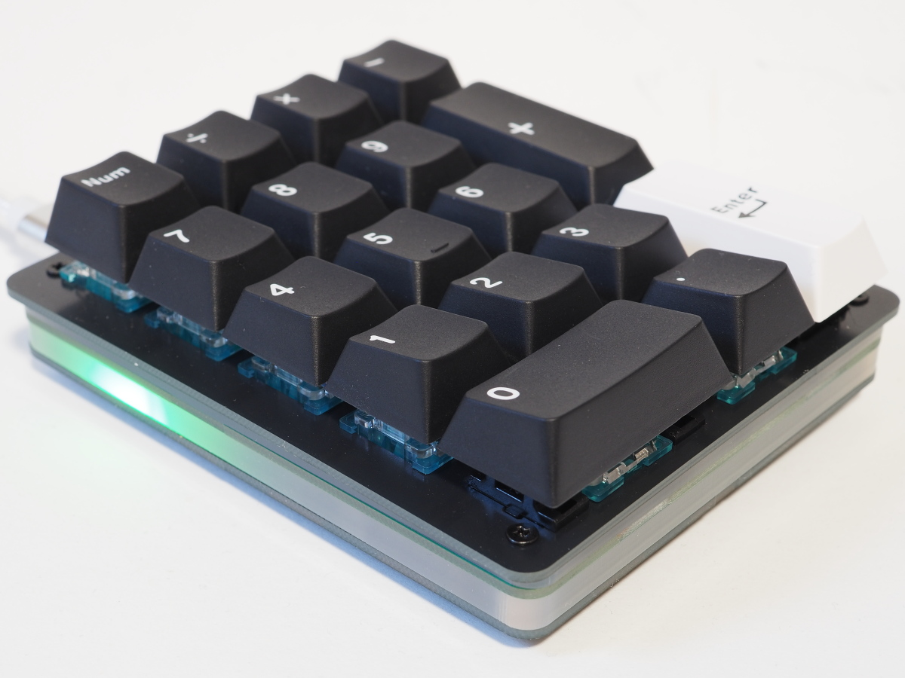

# CH552 Numeric Keypad revision 2

English version is here: [README_en.md](README_en.md)

このリポジトリは、CH552Gマイクロコントローラを使ったシンプルなUSBテンキーを作成するためのハードウェアの作成情報と、このハードウェアを動作させるためのキーボード用ソフトウェアについての情報を含んでいます。

## ハードウェア
**KiCad 6.0**用のファイル一式、製造に用いたガーバーファイル、アクリルカットのための DXF および PDFファイルが、hardware ディレクトリ内に入っています。

## ソフトウェア
上記のハードウェア用に記述した、マクロキーボードにもなるテンキーです。コアパッケージとして **ch55xDuino** (v0.25) を用いた Arduino 用のスケッチです。また、Arduinoのlibrariesディレクトリに `ch552_keyPad_Library` を配置しておく必要があります。

- `macro_numpad/` : マクロテンキーのファームウェアスケッチ
- `html/` : WebHID 設定用 Web UI

### webhid を使ったマクロキーボードの実装 (macro_numpad)
テンキーの17キーのうち、NumLock を除いた16キーに、**WebHID** を使って好きな UsageID を割り当てられるようにしています。

メディア操作やマウス操作など、ちょっと特別なコードも設定できます。また、1つのキーに複数の UsageID をまとめて登録できるので、ワンアクションで複数のキー入力をまとめて実行することもできます。

WebHIDのサンプル的な意味合いで記述しました。

### マクロキーボードの設定用webアプリケーション (htmlおよびjavascript)
マクロキーボードとWebHIDで通信し、ブラウザに表示する仮想キーボードとデバイス間とでコードの書込みや読出しを行うためのWebアプリケーションです。

## ライセンス
This project contains hardware and software components.

Copyright (c) Takeshi Higasa, okiraku-camera.tokyo

See [LICENSE](./LICENSE)

