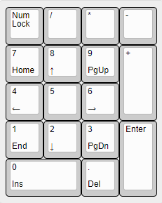

## ハードウェアについて 

ごくふつうのテンキーです。

ハードウェアの設計はKiCAD 6.0で行いました。各ディレクトリ内のKiCADプロジェクトファイルを開くことで、回路構成、PCB構成、各プレートの設計内容を見ることができます。

PCBおよびプレートについては、JLCPCBへの発注に使ったgerberファイルを含んでいます。また、アクリルサポートについては、アクリルカットの発注に使ったdxfおよびpdf (寸法線図) を含んでいます。

### PCB
chh552g を使ったふつうのテンキーを作成するためのPCBです。4列5行構成のスイッチマトリックス回路で、17個のMX互換スイッチを使います。スイッチの取付けには Keilh のスイッチソケット (Hotswap socket) を利用しています。

PCBの厚さは1.6mm、PCBのネジ穴径は3mmです。このネジ穴にはM2用の真鍮スペーサーが (途中まで) 入ります。

スイッチのレイアウトについて、図を参照してください。

### top_support
PCBとtop_plate (スイッチプレート)の間に位置する3mm厚のアクリル板を加工したサポート用の部材です。

top_supportの上側 (top_plate側) には、1mm厚の隙間テープと呼ばれるウレタンスポンジのテープを貼ることで、ソケットを用いるスイッチに必要な4mm弱のクリアランスを確保しています。

top_supportのネジ穴にはM2ネジを通しますが、ネジ穴径は工作精度などを考慮して 2.4mmとしています。

### top_plate
MXスイッチをマウントするためのスイッチプレートです。各スイッチは、13.9mm角の矩形にはめ込みます。MXスイッチの仕様的には14mm角の矩形が求められていますが、実際にスイッチをはめると緩かったりガタつくことがあるので、小さ目にしています。

今回のキーボードはCherryスタイルのプレートマウントスタビライザーを用いるため、そのためのフットプリントを用意しました。

スイッチをはめ込むためのホールは、今回の設計では単純な矩形としていますが、半径0.5mm程度の円弧で丸めた方が割れを防ぐ面で安全です。

プレートの厚さ1.5mm、ネジ穴径は2.4mmです。1.5mm厚のPCBは、F面、B面ともに銅箔による塗りつぶしを指定していないPCBということにしています。

※ 注意点

top_plate\libに含まれている プレートマウントスタビライザー用のフットプリント (MX_Plate_Mount_Stabilizer_2U.kicad_mod) と、M2ネジのマウントホール用フットプリント (MountingHole_M2.kicad_mod) にコートヤードを設定しなかったため、Enterキー用のスタビライザーがネジ穴に干渉します。これについては、実装後にスタビライザーの一部を切り取ることで対処可能です。

### bottom_support
PCBとbottom_plateの間に入る5mm厚のアクリル板を加工したサポート部材です。PCBのB面に実装するUSBコネクタやスイッチソケットのために5mmのクリアランスが必要です。

bottom_supportのネジにはM2ネジ用の真鍮スペーサーを通すため、穴径は3mmです。直結3mmとすることで、スペーサーを無理やりはめ込むような感触になりますが、組み立て時に落下することもなくなります。

### bottom_plate
キーボードの底板になります。1.6mmのPCBを指定し、B面は導体ゾーンと塗りつぶし禁止エリアを組み合わせた市松模様にしました。

ネジ穴径は3mmです。

## 組み立て
以下の図のように、各プレート、サポートをネジとスペーサーで固定しています。

