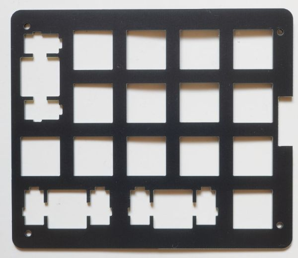
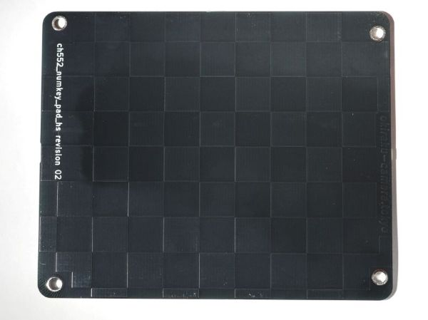
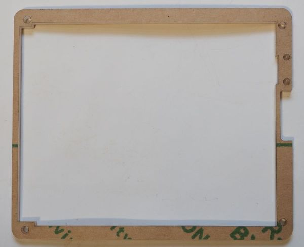
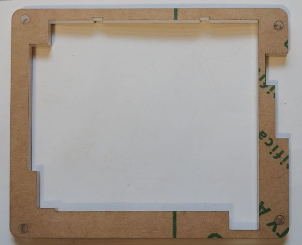
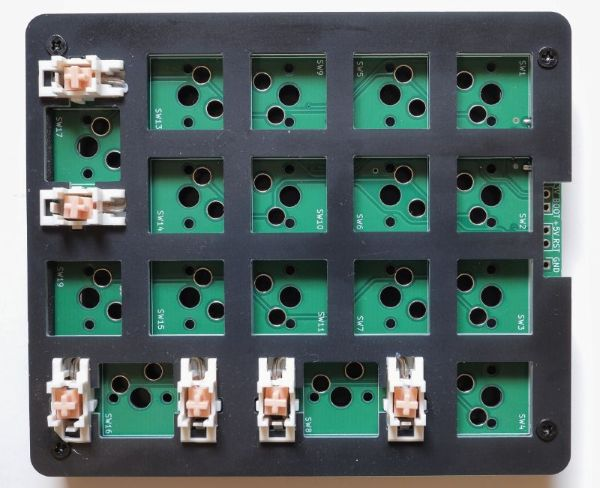
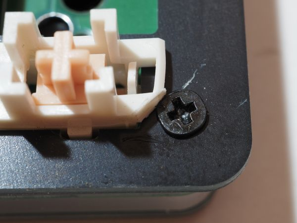
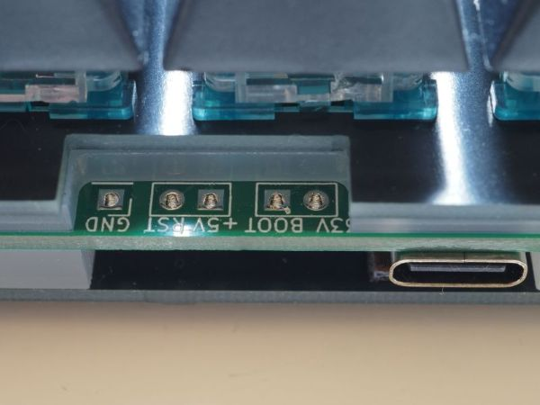

# ハードウェアについて

CH552Gマイクロコントローラを使ったシンプルなUSBテンキーです。

このプロジェクトには、PCB、FR-4を使ったプレート、アクリル板を使ったポート部品の、KiCad設計ファイルが含まれています。

製造およびアクリルカットに用いたgerber、DXF、およびPDFファイルも含んでいます。

ハードウェアの設計はKiCAD 6.0で行いました。各ディレクトリ内のKiCADプロジェクトファイルを開くことで、回路構成、PCB構成、各プレートの設計内容を見ることができます。

## PCBおよびプレート
PCB、スイッチをはめ込むtop_plate、底板となる bottom_plate は、材質はFR-4で製造時の厚さ指定は1.6mmです。

### PCB
chh552g を使ったふつうのテンキーを作成するためのPCBです。4列5行構成のスイッチマトリックス回路で、17個のMX互換スイッチを使います。スイッチの取付けには Keilh のスイッチソケット (Hotswap socket) を利用します。

PCBの厚さは1.6mm、PCBのネジ穴径は3mmです。このネジ穴にはM2用の真鍮スペーサーが (途中まで) 入ります。

### top_plate
MXスイッチをマウントするためのスイッチプレートです。各スイッチは、13.9mm角の矩形にはめ込みます。MXスイッチの仕様的には14mm角の矩形が求められていますが、実際にスイッチをはめると緩かったりガタつくことがあるので、小さ目にしています。

今回のキーボードはCherryスタイルのプレートマウントスタビライザーを用いるため、そのためのフットプリントを用意しました。

スイッチをはめ込むためのホールは、今回の設計では単純な矩形としていますが、半径0.5mm程度の円弧で丸めた方が割れを防ぐ面で安全です。

プレートの厚さ1.5mm、ネジ穴径は2.4mmです。

### bottom_plate
キーボードの底板になります。1.6mmのPCBを指定し、B面は導体ゾーンと塗りつぶし禁止エリアを組み合わせた市松模様にしました。

ネジ穴径は3mmです。

### 注意点

top_plate\libに含まれている プレートマウントスタビライザー用のフットプリント (MX_Plate_Mount_Stabilizer_2U.kicad_mod) と、M2ネジのマウントホール用フットプリント (MountingHole_M2.kicad_mod) にコートヤードを設定しなかったため、Enterキー用のスタビライザーの一部がネジ穴に干渉します。実装後にスタビライザーの一部を切り取ることで対処可能です。

### アクリルサポート
3枚のプレート (PCB, top, bottom) 間のクリアランスを確保するための、アクリル板によるサポート部材です。アクリル板の厚さや部材(透明、半透明、色など) はアクリルカットをやってくれる業者 (Elecrow社など) に対して指定しています。

### top_support
PCBとtop_plate (スイッチプレート)の間に位置する3mm厚のアクリル板です。

top_supportの上側 (top_plate側) には、1mm厚の隙間テープと呼ばれるウレタンスポンジのテープを貼ることで、ソケットを用いるスイッチに必要な4mm弱のクリアランスを確保しています。

このPCBで使っているUSBレセプタクルの固定用ポストの高さは2.0mmであり、PCBのF面側に若干突き出します。アクリル板との干渉を防ぐため、top_support の該当位置に小さな穴を2つ用意しています。

カットされたアクリル板は、写真のように保護紙が貼られた状態で納品されます。

top_supportのネジ穴にはM2ネジを通しますが、ネジ穴径は工作精度などを考慮して 2.4mmとしています。

### bottom_support
PCBとbottom_plateの間に入る5mm厚のアクリル板を加工したサポート部材です。PCBのB面に実装するUSBコネクタやスイッチソケットと、底板のあいだには約5mmのクリアランスが必要です。

bottom_supportのネジ穴は、M2ネジ用の真鍮スペーサーの外形と同じ3.0mmを指定しています。

## 組み立て
以下の図のように、各プレート、サポートをネジとスペーサーで固定します。

4mm長のM2ネジをねじ込んだ状態のスペーサーを底側から挿入すると、PCBの途中まで達します。その状態でpcbの上に top_supportとtop_plate を置き、上からネジで締め込みます。隙間テープは、top_supportの上側に事前に貼り付けておきます。

bottom_plate, bottom_supportのネジ穴径が3.0mmであるため、組み立て時にはスペーサーを無理やりはめ込むような感触になります。しかしながら、組み立て時に全体を持ち上げてもスペーサーが落下することがないので、作業しやすくなります。

仮組みして、スタビライザーがPCBに接触したり、干渉しないことを確認。

Enterキー位置のネジ穴と干渉するため、スタビライザーをわずかにカット。

## ファームウェアの更新について
C552の **P3.6ピンを+3.3Vでプルアップした状態で電源を投入**すると、CH552はブートローダーモードで開始し、数秒間その状態を保持します。そのタイミングでファームウェアをUSB経由で送信することで、ファームウェアを更新できます。

このPCBでは P3.6(UDP)のプルアップがしやすいよう基板の上端にBOOTと33Vという2つのスルーホールパッドを用意しています。2つのパッドをピンセットなどで接続した状態で USBケーブルを接続することで、ブートローダーモードが開始します。ファームウェアの転送中もこれらのパッドを接続したままで問題ないようです。

なお、ファームウェアのアップロードが完了しても自動的にリスタートしないため、BOOTの隣にあるリセット用のパッド (RSTと+5V) を接続してハードウェアリセットをかける必要があります。こちらについても、ピンセットでつまんでやる感じです。

