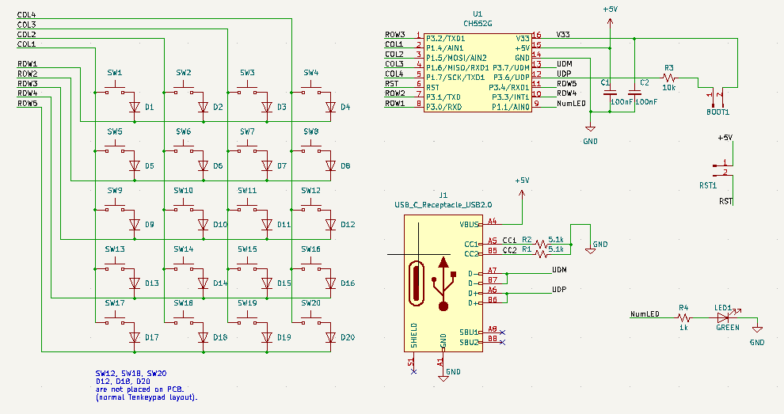
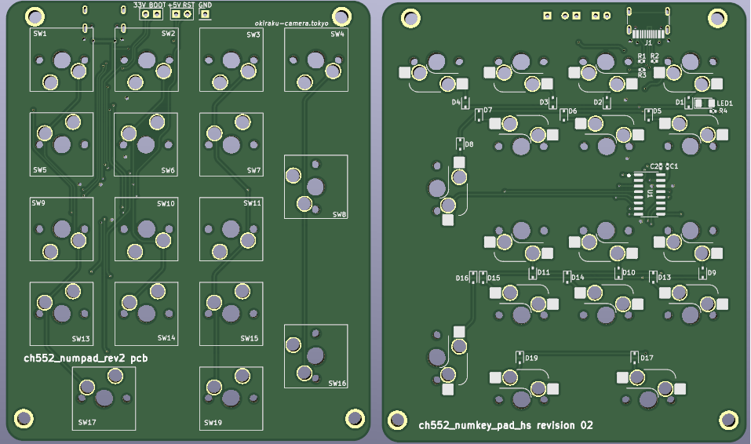
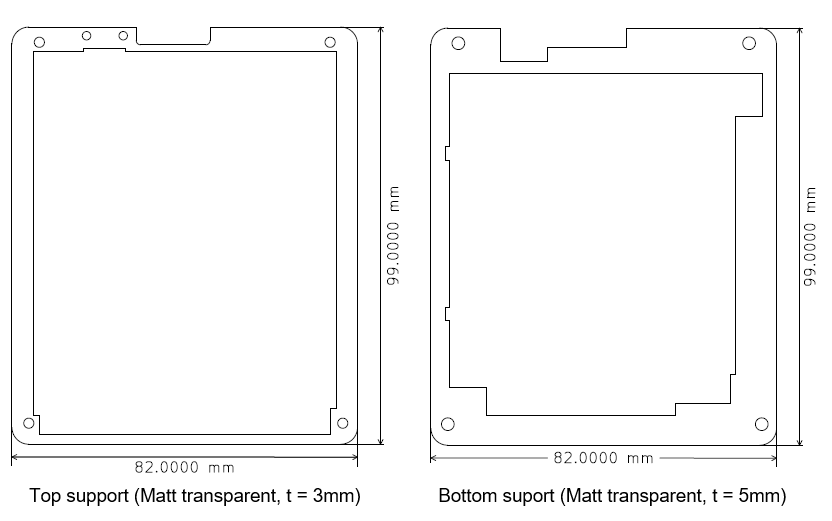
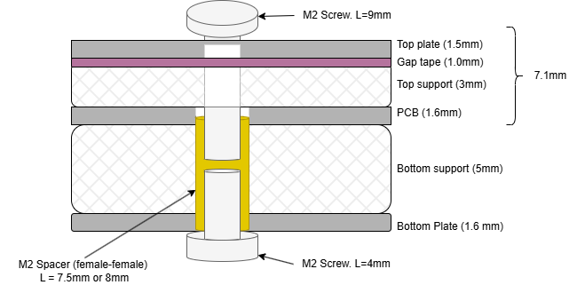

# CH552 Numeric Keypad

A simple USB numeric keypad based on the CH552G microcontroller.

The project includes KiCad design files for the PCB, FR-4 plates, and acrylic support parts.

Gerber, DXF, and PDF files used for manufacturing and acrylic cutting are also provided.

The hardware was designed using KiCAD 6.0. By opening the KiCAD project files in each directory, you can view the circuit design, PCB layout, and plate designs.

For the PCB and plates, the Gerber files used for ordering are included. For the acrylic support parts, the directory contains the DXF files and PDF dimension drawings used for acrylic cutting orders.

## PCB and Plates
The PCB, the top plate (switch plate), and the bottom plate are all made of FR‑4 with a specified thickness of 1.6 mm.

### PCB

This PCB is designed for building a simple numeric keypad using the CH552G. It uses a 4‑column × 5‑row switch matrix and supports 17 MX‑compatible switches. Kailh hot‑swap sockets are used for mounting the switches.

The PCB thickness is 1.6 mm, and the screw hole diameter is 3 mm. M2 brass spacers are designed to fit partially into these holes.

### top_plate
This is the switch plate for mounting MX switches. Each switch fits into a 13.9 mm square cutout. Although the MX specification calls for a 14 mm square, a slightly smaller size helps reduce looseness and wobble when inserting switches.

Since this keyboard uses Cherry‑style plate‑mount stabilizers, the corresponding footprints are included.
The switch cutouts are simple rectangles in this design, but adding small fillets (around 0.5 mm radius) is safer to prevent cracking.
The plate thickness is 1.5 mm, and the screw hole diameter is 2.4 mm.

### bottom_plate
This is the bottom plate of the keyboard. The PCB thickness is specified as 1.6 mm.

The B-side copper layer uses a checkerboard pattern created with copper zones and keep-out areas.

The screw hole diameter is 3 mm.

### Notes

Because the footprints for the plate‑mount stabilizer (MX_Plate_Mount_Stabilizer_2U.kicad_mod) and the M2 mounting hole (MountingHole_M2.kicad_mod) in top_plate/lib do not define courtyards, part of the Enter‑key stabilizer interferes with a screw hole. This can be resolved by trimming a small portion of the stabilizer after assembly.

### Acrylic Supports
These acrylic support parts ensure proper clearance between the three plates (PCB, top, bottom). The acrylic thickness and material (clear, frosted, colored, etc.) are specified when ordering from acrylic‑cutting services such as Elecrow.

### top_support
This is a 3 mm thick acrylic plate placed between the PCB and the top plate.
A 1 mm‑thick urethane “gap tape” is applied to the top side (toward the top plate) to secure the nearly 4 mm clearance required for switches using hot‑swap sockets.
M2 screws pass through the top_support, and the screw hole diameter is set to 2.4 mm to account for machining tolerances.

### bottom_support
This is a 5 mm thick acrylic support placed between the PCB and the bottom plate. Approximately 5 mm of clearance is required between the USB connector and switch sockets on the PCB’s B‑side and the bottom plate.
The screw hole diameter is 3.0 mm, matching the outer diameter of M2 brass spacers.

## Assembly
As shown in the diagram below, the plates and supports are fixed together using screws and spacers.

Insert spacers with 4 mm M2 screws pre‑threaded into them from the bottom side; they will reach partway into the PCB. Place the top_support and top_plate on the PCB, then tighten screws from above. The gap tape should be applied to the top side of the top_support beforehand.

Because the screw holes in the bottom_plate and bottom_support are 3.0 mm, inserting the spacers during assembly may feel slightly tight. However, once inserted, the spacers will not fall out even if the assembly is lifted, making the process easier.

